## Reference
  - [Understand Consul Service Mesh](https://learn.hashicorp.com/tutorials/consul/service-mesh?in=consul/gs-consul-service-mesh)
  - [Consul on GitHub](https://github.com/hashicorp/consul)
  - [Tutorial - Run Consul on k8s](https://learn.hashicorp.com/tutorials/consul/kubernetes-minikube)

## Prerequisites

```
[fli@koala ~]$ minikube status
minikube
type: Control Plane
host: Running
kubelet: Running
apiserver: Running
kubeconfig: Configured

[fli@koala ~]$

[fli@koala ~]$ helm version
version.BuildInfo{Version:"v3.3.0", GitCommit:"8a4aeec08d67a7b84472007529e8097ec3742105", GitTreeState:"dirty", GoVersion:"go1.14.7"}
[fli@koala ~]$

[fli@koala ~]$ kubectl version
Client Version: version.Info{Major:"1", Minor:"19", GitVersion:"v1.19.0", GitCommit:"e19964183377d0ec2052d1f1fa930c4d7575bd50", GitTreeState:"clean", BuildDate:"2020-08-26T14:30:33Z", GoVersion:"go1.15", Compiler:"gc", Platform:"linux/amd64"}
Server Version: version.Info{Major:"1", Minor:"18", GitVersion:"v1.18.3", GitCommit:"2e7996e3e2712684bc73f0dec0200d64eec7fe40", GitTreeState:"clean", BuildDate:"2020-05-20T12:43:34Z", GoVersion:"go1.13.9", Compiler:"gc", Platform:"linux/amd64"}
[fli@koala ~]$ 

[fli@koala ~]$ kubectl config view
apiVersion: v1
clusters:
- cluster:
    certificate-authority: /home/fli/.minikube/ca.crt
    server: https://192.168.39.140:8443
  name: minikube
contexts:
- context:
    cluster: minikube
    user: minikube
  name: minikube
current-context: minikube
kind: Config
preferences: {}
users:
- name: minikube
  user:
    client-certificate: /home/fli/.minikube/profiles/minikube/client.crt
    client-key: /home/fli/.minikube/profiles/minikube/client.key
[fli@koala ~]$ 

[fli@koala ~]$ kubectl get pods --all-namespaces
NAMESPACE     NAME                               READY   STATUS    RESTARTS   AGE
kube-system   coredns-66bff467f8-dlmmd           1/1     Running   1          3d7h
kube-system   etcd-minikube                      1/1     Running   1          3d7h
kube-system   kube-apiserver-minikube            1/1     Running   1          3d7h
kube-system   kube-controller-manager-minikube   1/1     Running   1          3d7h
kube-system   kube-proxy-s8sv7                   1/1     Running   1          3d7h
kube-system   kube-scheduler-minikube            1/1     Running   1          3d7h
kube-system   storage-provisioner                1/1     Running   2          3d7h
[fli@koala ~]$ 
```

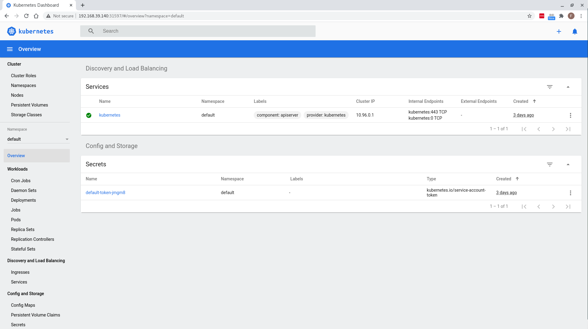

## Get the official Helm chart

```
[fli@koala ~]$ helm repo add hashicorp https://helm.releases.hashicorp.com
"hashicorp" has been added to your repositories
[fli@koala ~]$ 

[fli@koala ~]$ helm search repo hashicorp/consul
NAME            	CHART VERSION	APP VERSION	DESCRIPTION                    
hashicorp/consul	0.24.1       	1.8.2      	Official HashiCorp Consul Chart
[fli@koala ~]$ 
```

## Create `helm-consul-values.yaml`
```
[fli@koala minikube-lab]$ cat helm-consul-values.yaml 
# Choose an optional name for the datacenter
global:
  domain: consul
  datacenter: minidc
  image: consul:1.8.2

# Enable the Consul Web UI via a NodePort
ui:
  service:
    type: 'NodePort'

# Enable Connect for secure communication between nodes
connectInject:
  enabled: true

client:
  enabled: true

# Use only one Consul server for local development
server:
  replicas: 1
  bootstrapExpect: 1
  disruptionBudget:
    enabled: true
    maxUnavailable: 0
[fli@koala minikube-lab]$ 
```

## Deploy consul service to minikube

```
[fli@koala minikube-lab]$ pwd
/home/fli/minikube-lab
[fli@koala minikube-lab]$ 

[fli@koala minikube-lab]$ helm install -f helm-consul-values.yaml hashicorp hashicorp/consul
NAME: hashicorp
LAST DEPLOYED: Mon Aug 31 08:26:27 2020
NAMESPACE: default
STATUS: deployed
REVISION: 1
NOTES:
Thank you for installing HashiCorp Consul!

Now that you have deployed Consul, you should look over the docs on using 
Consul with Kubernetes available here: 

https://www.consul.io/docs/platform/k8s/index.html


Your release is named hashicorp.

To learn more about the release if you are using Helm 2, run:

  $ helm status hashicorp
  $ helm get hashicorp

To learn more about the release if you are using Helm 3, run:

  $ helm status hashicorp
  $ helm get all hashicorp
[fli@koala minikube-lab]$ 

[fli@koala minikube-lab]$ kubectl get pods
NAME                                                              READY   STATUS    RESTARTS   AGE
hashicorp-consul-9jrmq                                            0/1     Running   0          96s
hashicorp-consul-connect-injector-webhook-deployment-cbd67kqfsh   1/1     Running   0          96s
hashicorp-consul-server-0                                         1/1     Running   0          96s
[fli@koala minikube-lab]$ 

[fli@koala minikube-lab]$ kubectl get pods
NAME                                                              READY   STATUS    RESTARTS   AGE
hashicorp-consul-9jrmq                                            1/1     Running   0          2m6s
hashicorp-consul-connect-injector-webhook-deployment-cbd67kqfsh   1/1     Running   0          2m6s
hashicorp-consul-server-0                                         1/1     Running   0          2m6s
[fli@koala minikube-lab]$ 
```

## Access the Consul UI
```
[fli@koala minikube-lab]$ minikube service list
|----------------------|---------------------------------------|--------------|-----------------------------|
|      NAMESPACE       |                 NAME                  | TARGET PORT  |             URL             |
|----------------------|---------------------------------------|--------------|-----------------------------|
| default              | hashicorp-consul-connect-injector-svc | No node port |
| default              | hashicorp-consul-dns                  | No node port |
| default              | hashicorp-consul-server               | No node port |
| default              | hashicorp-consul-ui                   | http/80      | http://192.168.39.140:32068 |
| default              | kubernetes                            | No node port |
| kube-system          | kube-dns                              | No node port |
| kubernetes-dashboard | dashboard-metrics-scraper             | No node port |
| kubernetes-dashboard | kubernetes-dashboard                  |           80 | http://192.168.39.140:31597 |
|----------------------|---------------------------------------|--------------|-----------------------------|
[fli@koala minikube-lab]$ 

[fli@koala minikube-lab]$ minikube service hashicorp-consul-ui
|-----------|---------------------|-------------|-----------------------------|
| NAMESPACE |        NAME         | TARGET PORT |             URL             |
|-----------|---------------------|-------------|-----------------------------|
| default   | hashicorp-consul-ui | http/80     | http://192.168.39.140:32068 |
|-----------|---------------------|-------------|-----------------------------|
🎉  Opening service default/hashicorp-consul-ui in default browser...
This tool has been deprecated, use 'gio open' instead.
See 'gio help open' for more info.

[fli@koala minikube-lab]$
```

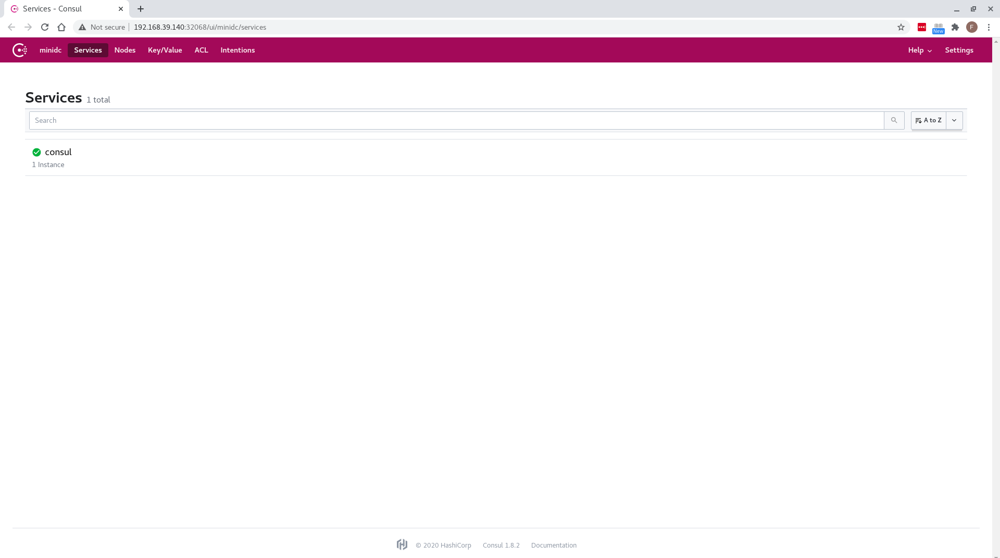

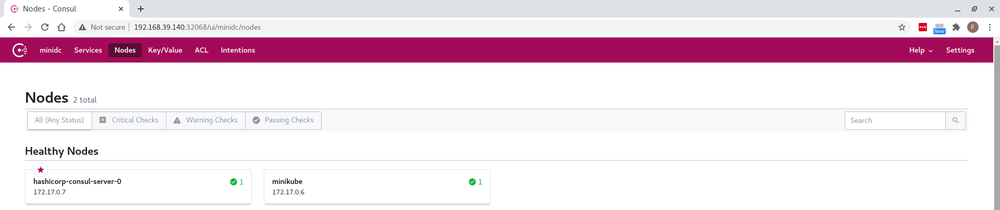

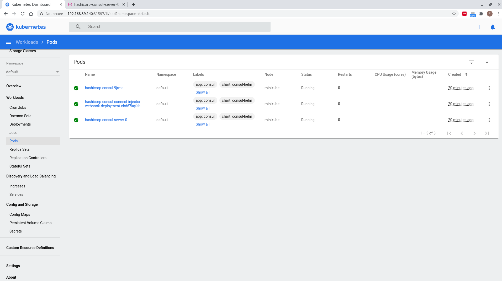

## Access Consul container
```
[fli@koala ~]$ kubectl exec -it hashicorp-consul-server-0 -- /bin/sh
/ # consul members
Node                       Address          Status  Type    Build  Protocol  DC      Segment
hashicorp-consul-server-0  172.17.0.7:8301  alive   server  1.8.2  2         minidc  <all>
minikube                   172.17.0.6:8301  alive   client  1.8.2  2         minidc  <default>
/ # exit
[fli@koala ~]$ 
```

## (optional) expose consul dashboard by using port-forwarding

```
[fli@koala minikube-lab]$ kubectl port-forward service/hashicorp-consul-ui 18500:80 --address 0.0.0.0 &
[1] 11258
Forwarding from 0.0.0.0:18500 -> 8500

[fli@koala minikube-lab]$ 
```

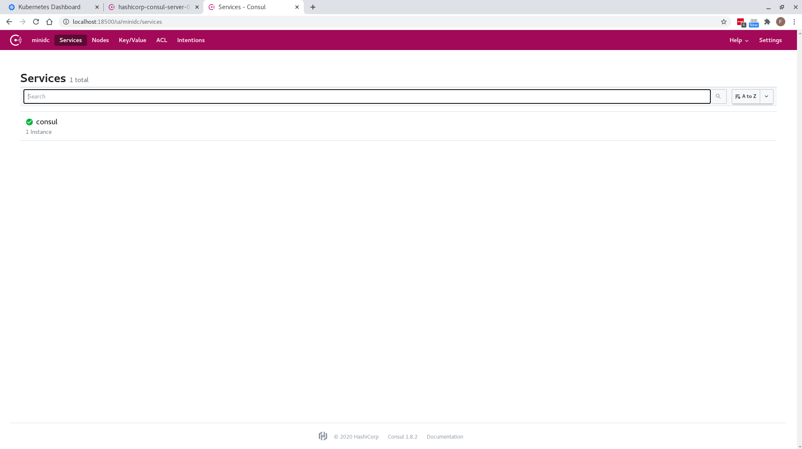

## Secure Applications with Service Sidecar Proxies

* create `k8s-config/api.yml` & `k8s-config/web.yml`

* deploy api service and web service

```
[fli@koala minikube-lab]$ kubectl apply -f k8s-config/api.yml -f k8s-config/web.yml 
deployment.apps/api-deployment-v1 created
deployment.apps/web-deployment created
service/web created
[fli@koala minikube-lab]$ 

[fli@koala minikube-lab]$ kubectl get pods
NAME                                                              READY   STATUS            RESTARTS   AGE
api-deployment-v1-6c9f79dc99-xmkfj                                0/3     PodInitializing   0          58s
hashicorp-consul-9jrmq                                            1/1     Running           0          81m
hashicorp-consul-connect-injector-webhook-deployment-cbd67kqfsh   1/1     Running           0          81m
hashicorp-consul-server-0                                         1/1     Running           0          81m
web-deployment-7988b8f66c-fwkzz                                   0/3     PodInitializing   0          58s
[fli@koala minikube-lab]$ kubectl get pods
NAME                                                              READY   STATUS    RESTARTS   AGE
api-deployment-v1-6c9f79dc99-xmkfj                                3/3     Running   0          93s
hashicorp-consul-9jrmq                                            1/1     Running   0          82m
hashicorp-consul-connect-injector-webhook-deployment-cbd67kqfsh   1/1     Running   0          82m
hashicorp-consul-server-0                                         1/1     Running   0          82m
web-deployment-7988b8f66c-fwkzz                                   3/3     Running   0          93s
[fli@koala minikube-lab]$ 
```

* check new `api` & `web` services in consul dashboard

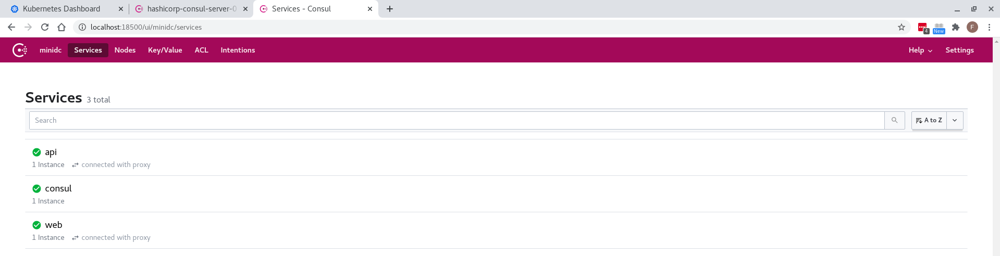

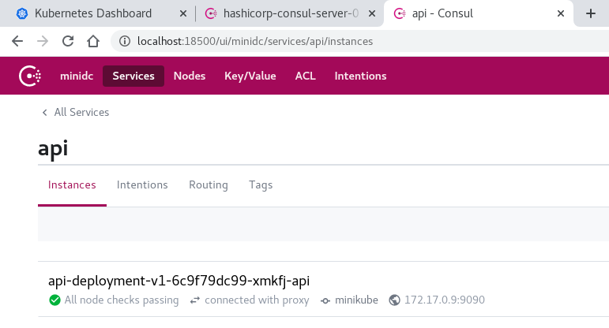

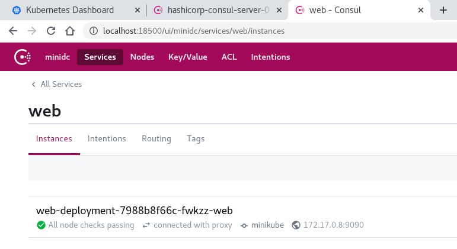

* check pods details to ensure sidecar containers are up and running
```
[fli@koala minikube-lab]$ kubectl get pods
NAME                                                              READY   STATUS    RESTARTS   AGE
api-deployment-v1-6c9f79dc99-xmkfj                                3/3     Running   0          7m50s
hashicorp-consul-9jrmq                                            1/1     Running   0          88m
hashicorp-consul-connect-injector-webhook-deployment-cbd67kqfsh   1/1     Running   0          88m
hashicorp-consul-server-0                                         1/1     Running   0          88m
web-deployment-7988b8f66c-fwkzz                                   3/3     Running   0          7m50s
[fli@koala minikube-lab]$

[fli@koala minikube-lab]$ kubectl describe pod api-deployment-v1-6c9f79dc99-xmkfj
Name:         api-deployment-v1-6c9f79dc99-xmkfj
Namespace:    default
Priority:     0
Node:         minikube/192.168.39.140
Start Time:   Mon, 31 Aug 2020 09:47:16 +1000
Labels:       app=api-v1
              pod-template-hash=6c9f79dc99
Annotations:  consul.hashicorp.com/connect-inject: true
              consul.hashicorp.com/connect-inject-status: injected
              consul.hashicorp.com/connect-service: api
              consul.hashicorp.com/connect-service-port: 9090
Status:       Running
IP:           172.17.0.9
IPs:
  IP:           172.17.0.9
Controlled By:  ReplicaSet/api-deployment-v1-6c9f79dc99
Init Containers:
  consul-connect-inject-init:
    Container ID:  docker://cac11e85ae84c2ffcdf89469804ed6b6cb6e52afddde513225700cc8351e801b
    Image:         consul:1.8.2
    Image ID:      docker-pullable://consul@sha256:539a85ebc1e83bc76f6f3cfde6c7a1e8a3a4d46fcbd824de44ccfd3f6f82415a
    Port:          <none>
    Host Port:     <none>
    Command:
      /bin/sh
      -ec
      
      export CONSUL_HTTP_ADDR="${HOST_IP}:8500"
      export CONSUL_GRPC_ADDR="${HOST_IP}:8502"
      
      # Register the service. The HCL is stored in the volume so that
      # the preStop hook can access it to deregister the service.
      cat <<EOF >/consul/connect-inject/service.hcl
      services {
        id   = "${SERVICE_ID}"
        name = "api"
        address = "${POD_IP}"
        port = 9090
        meta = {
          pod-name = "${POD_NAME}"
        }
      }
      
      services {
        id   = "${PROXY_SERVICE_ID}"
        name = "api-sidecar-proxy"
        kind = "connect-proxy"
        address = "${POD_IP}"
        port = 20000
        meta = {
          pod-name = "${POD_NAME}"
        }
      
        proxy {
          destination_service_name = "api"
          destination_service_id = "${SERVICE_ID}"
          local_service_address = "127.0.0.1"
          local_service_port = 9090
        }
      
        checks {
          name = "Proxy Public Listener"
          tcp = "${POD_IP}:20000"
          interval = "10s"
          deregister_critical_service_after = "10m"
        }
      
        checks {
          name = "Destination Alias"
          alias_service = "${SERVICE_ID}"
        }
      }
      EOF
      
      /bin/consul services register \
        /consul/connect-inject/service.hcl
      
      # Generate the envoy bootstrap code
      /bin/consul connect envoy \
        -proxy-id="${PROXY_SERVICE_ID}" \
        -bootstrap > /consul/connect-inject/envoy-bootstrap.yaml
      
      # Copy the Consul binary
      cp /bin/consul /consul/connect-inject/consul
    State:          Terminated
      Reason:       Completed
      Exit Code:    0
      Started:      Mon, 31 Aug 2020 09:47:24 +1000
      Finished:     Mon, 31 Aug 2020 09:47:37 +1000
    Ready:          True
    Restart Count:  0
    Limits:
      cpu:     50m
      memory:  150Mi
    Requests:
      cpu:     50m
      memory:  25Mi
    Environment:
      HOST_IP:            (v1:status.hostIP)
      POD_IP:             (v1:status.podIP)
      POD_NAME:          api-deployment-v1-6c9f79dc99-xmkfj (v1:metadata.name)
      POD_NAMESPACE:     default (v1:metadata.namespace)
      SERVICE_ID:        $(POD_NAME)-api
      PROXY_SERVICE_ID:  $(POD_NAME)-api-sidecar-proxy
    Mounts:
      /consul/connect-inject from consul-connect-inject-data (rw)
      /var/run/secrets/kubernetes.io/serviceaccount from default-token-jmgm8 (ro)
Containers:
  api:
    Container ID:   docker://dfffb9b5a42006dc11e7cfd127be4dbf9c3f32235c29bcbff7c17d4690c6d90f
    Image:          nicholasjackson/fake-service:v0.7.8
    Image ID:       docker-pullable://nicholasjackson/fake-service@sha256:614f71035f1adf4d94b189a3e0cc7b49fe783cf97b6b00b5e24f3c235f4ea14e
    Port:           9090/TCP
    Host Port:      0/TCP
    State:          Running
      Started:      Mon, 31 Aug 2020 09:47:54 +1000
    Ready:          True
    Restart Count:  0
    Environment:
      LISTEN_ADDR:  127.0.0.1:9090
      NAME:         api-v1
      MESSAGE:      Response from API v1
    Mounts:
      /var/run/secrets/kubernetes.io/serviceaccount from default-token-jmgm8 (ro)
  consul-connect-envoy-sidecar:
    Container ID:  docker://883d38aba25f5cad3aef36a1f5eac516204bd47ec5f9fec145d14f4f81ed3a0d
    Image:         envoyproxy/envoy-alpine:v1.13.0
    Image ID:      docker-pullable://envoyproxy/envoy-alpine@sha256:19f3b361450e31f68b46f891b0c8726041739f44ab9b90aecbca5f426c0d2eaf
    Port:          <none>
    Host Port:     <none>
    Command:
      envoy
      --max-obj-name-len
      256
      --config-path
      /consul/connect-inject/envoy-bootstrap.yaml
    State:          Running
      Started:      Mon, 31 Aug 2020 09:48:13 +1000
    Ready:          True
    Restart Count:  0
    Environment:
      HOST_IP:            (v1:status.hostIP)
      CONSUL_HTTP_ADDR:  $(HOST_IP):8500
    Mounts:
      /consul/connect-inject from consul-connect-inject-data (rw)
      /var/run/secrets/kubernetes.io/serviceaccount from default-token-jmgm8 (ro)
  consul-connect-lifecycle-sidecar:
    Container ID:  docker://39eab3d74563dce24c2ee1dda14e8340191323d43e3169c3f7ee2881af738a8e
    Image:         hashicorp/consul-k8s:0.18.1
    Image ID:      docker-pullable://hashicorp/consul-k8s@sha256:e88ae391bb4aa3f31b688f48a5291d65e962f9301392e4bdf57213e65265116a
    Port:          <none>
    Host Port:     <none>
    Command:
      consul-k8s
      lifecycle-sidecar
      -service-config
      /consul/connect-inject/service.hcl
      -consul-binary
      /consul/connect-inject/consul
    State:          Running
      Started:      Mon, 31 Aug 2020 09:48:17 +1000
    Ready:          True
    Restart Count:  0
    Limits:
      cpu:     20m
      memory:  50Mi
    Requests:
      cpu:     20m
      memory:  25Mi
    Environment:
      HOST_IP:            (v1:status.hostIP)
      CONSUL_HTTP_ADDR:  $(HOST_IP):8500
    Mounts:
      /consul/connect-inject from consul-connect-inject-data (rw)
      /var/run/secrets/kubernetes.io/serviceaccount from default-token-jmgm8 (ro)
Conditions:
  Type              Status
  Initialized       True 
  Ready             True 
  ContainersReady   True 
  PodScheduled      True 
Volumes:
  default-token-jmgm8:
    Type:        Secret (a volume populated by a Secret)
    SecretName:  default-token-jmgm8
    Optional:    false
  consul-connect-inject-data:
    Type:        EmptyDir (a temporary directory that shares a pod's lifetime)
    Medium:      
    SizeLimit:   <unset>
QoS Class:       Burstable
Node-Selectors:  <none>
Tolerations:     node.kubernetes.io/not-ready:NoExecute op=Exists for 300s
                 node.kubernetes.io/unreachable:NoExecute op=Exists for 300s
Events:
  Type    Reason     Age    From               Message
  ----    ------     ----   ----               -------
  Normal  Scheduled  8m14s  default-scheduler  Successfully assigned default/api-deployment-v1-6c9f79dc99-xmkfj to minikube
  Normal  Pulled     8m8s   kubelet, minikube  Container image "consul:1.8.2" already present on machine
  Normal  Created    8m6s   kubelet, minikube  Created container consul-connect-inject-init
  Normal  Started    8m5s   kubelet, minikube  Started container consul-connect-inject-init
  Normal  Pulling    7m49s  kubelet, minikube  Pulling image "nicholasjackson/fake-service:v0.7.8"
  Normal  Pulled     7m37s  kubelet, minikube  Successfully pulled image "nicholasjackson/fake-service:v0.7.8"
  Normal  Pulling    7m35s  kubelet, minikube  Pulling image "envoyproxy/envoy-alpine:v1.13.0"
  Normal  Created    7m35s  kubelet, minikube  Created container api
  Normal  Started    7m35s  kubelet, minikube  Started container api
  Normal  Pulled     7m18s  kubelet, minikube  Successfully pulled image "envoyproxy/envoy-alpine:v1.13.0"
  Normal  Created    7m17s  kubelet, minikube  Created container consul-connect-envoy-sidecar
  Normal  Started    7m16s  kubelet, minikube  Started container consul-connect-envoy-sidecar
  Normal  Pulled     7m16s  kubelet, minikube  Container image "hashicorp/consul-k8s:0.18.1" already present on machine
  Normal  Created    7m15s  kubelet, minikube  Created container consul-connect-lifecycle-sidecar
  Normal  Started    7m12s  kubelet, minikube  Started container consul-connect-lifecycle-sidecar
[fli@koala minikube-lab]$ 

[fli@koala minikube-lab]$ kubectl describe pod web-deployment-7988b8f66c-fwkzz
Name:         web-deployment-7988b8f66c-fwkzz
Namespace:    default
Priority:     0
Node:         minikube/192.168.39.140
Start Time:   Mon, 31 Aug 2020 09:47:16 +1000
Labels:       app=web
              pod-template-hash=7988b8f66c
Annotations:  consul.hashicorp.com/connect-inject: true
              consul.hashicorp.com/connect-inject-status: injected
              consul.hashicorp.com/connect-service: web
              consul.hashicorp.com/connect-service-port: 9090
              consul.hashicorp.com/connect-service-upstreams: api:9091
Status:       Running
IP:           172.17.0.8
IPs:
  IP:           172.17.0.8
Controlled By:  ReplicaSet/web-deployment-7988b8f66c
Init Containers:
  consul-connect-inject-init:
    Container ID:  docker://efd17ab3ac4b3e791a07ec8f4fecce699527ed110c8ca693c5d193ddba82eaca
    Image:         consul:1.8.2
    Image ID:      docker-pullable://consul@sha256:539a85ebc1e83bc76f6f3cfde6c7a1e8a3a4d46fcbd824de44ccfd3f6f82415a
    Port:          <none>
    Host Port:     <none>
    Command:
      /bin/sh
      -ec
      
      export CONSUL_HTTP_ADDR="${HOST_IP}:8500"
      export CONSUL_GRPC_ADDR="${HOST_IP}:8502"
      
      # Register the service. The HCL is stored in the volume so that
      # the preStop hook can access it to deregister the service.
      cat <<EOF >/consul/connect-inject/service.hcl
      services {
        id   = "${SERVICE_ID}"
        name = "web"
        address = "${POD_IP}"
        port = 9090
        meta = {
          pod-name = "${POD_NAME}"
        }
      }
      
      services {
        id   = "${PROXY_SERVICE_ID}"
        name = "web-sidecar-proxy"
        kind = "connect-proxy"
        address = "${POD_IP}"
        port = 20000
        meta = {
          pod-name = "${POD_NAME}"
        }
      
        proxy {
          destination_service_name = "web"
          destination_service_id = "${SERVICE_ID}"
          local_service_address = "127.0.0.1"
          local_service_port = 9090
          upstreams {
            destination_type = "service" 
            destination_name = "api"
            local_bind_port = 9091
          }
        }
      
        checks {
          name = "Proxy Public Listener"
          tcp = "${POD_IP}:20000"
          interval = "10s"
          deregister_critical_service_after = "10m"
        }
      
        checks {
          name = "Destination Alias"
          alias_service = "${SERVICE_ID}"
        }
      }
      EOF
      
      /bin/consul services register \
        /consul/connect-inject/service.hcl
      
      # Generate the envoy bootstrap code
      /bin/consul connect envoy \
        -proxy-id="${PROXY_SERVICE_ID}" \
        -bootstrap > /consul/connect-inject/envoy-bootstrap.yaml
      
      # Copy the Consul binary
      cp /bin/consul /consul/connect-inject/consul
    State:          Terminated
      Reason:       Completed
      Exit Code:    0
      Started:      Mon, 31 Aug 2020 09:47:23 +1000
      Finished:     Mon, 31 Aug 2020 09:47:35 +1000
    Ready:          True
    Restart Count:  0
    Limits:
      cpu:     50m
      memory:  150Mi
    Requests:
      cpu:     50m
      memory:  25Mi
    Environment:
      HOST_IP:            (v1:status.hostIP)
      POD_IP:             (v1:status.podIP)
      POD_NAME:          web-deployment-7988b8f66c-fwkzz (v1:metadata.name)
      POD_NAMESPACE:     default (v1:metadata.namespace)
      SERVICE_ID:        $(POD_NAME)-web
      PROXY_SERVICE_ID:  $(POD_NAME)-web-sidecar-proxy
    Mounts:
      /consul/connect-inject from consul-connect-inject-data (rw)
      /var/run/secrets/kubernetes.io/serviceaccount from default-token-jmgm8 (ro)
Containers:
  web:
    Container ID:   docker://8b6e8680a679bf99e4bcd583cd52b325c8dd92250a9bc54ff0504eae905987da
    Image:          nicholasjackson/fake-service:v0.7.8
    Image ID:       docker-pullable://nicholasjackson/fake-service@sha256:614f71035f1adf4d94b189a3e0cc7b49fe783cf97b6b00b5e24f3c235f4ea14e
    Port:           9090/TCP
    Host Port:      0/TCP
    State:          Running
      Started:      Mon, 31 Aug 2020 09:47:51 +1000
    Ready:          True
    Restart Count:  0
    Environment:
      LISTEN_ADDR:               0.0.0.0:9090
      UPSTREAM_URIS:             http://localhost:9091
      NAME:                      web
      MESSAGE:                   Hello World
      API_CONNECT_SERVICE_HOST:  127.0.0.1
      API_CONNECT_SERVICE_PORT:  9091
    Mounts:
      /var/run/secrets/kubernetes.io/serviceaccount from default-token-jmgm8 (ro)
  consul-connect-envoy-sidecar:
    Container ID:  docker://dd76850e23dc9c2d5c3da2a84c21ab12c2b0cf58f78eb0a385ca2f2d100e7200
    Image:         envoyproxy/envoy-alpine:v1.13.0
    Image ID:      docker-pullable://envoyproxy/envoy-alpine@sha256:19f3b361450e31f68b46f891b0c8726041739f44ab9b90aecbca5f426c0d2eaf
    Port:          <none>
    Host Port:     <none>
    Command:
      envoy
      --max-obj-name-len
      256
      --config-path
      /consul/connect-inject/envoy-bootstrap.yaml
    State:          Running
      Started:      Mon, 31 Aug 2020 09:48:10 +1000
    Ready:          True
    Restart Count:  0
    Environment:
      HOST_IP:            (v1:status.hostIP)
      CONSUL_HTTP_ADDR:  $(HOST_IP):8500
    Mounts:
      /consul/connect-inject from consul-connect-inject-data (rw)
      /var/run/secrets/kubernetes.io/serviceaccount from default-token-jmgm8 (ro)
  consul-connect-lifecycle-sidecar:
    Container ID:  docker://69531eacc7f4d61e74d78b0fe0ea6baaf0be8a5c77af646f391114208668a966
    Image:         hashicorp/consul-k8s:0.18.1
    Image ID:      docker-pullable://hashicorp/consul-k8s@sha256:e88ae391bb4aa3f31b688f48a5291d65e962f9301392e4bdf57213e65265116a
    Port:          <none>
    Host Port:     <none>
    Command:
      consul-k8s
      lifecycle-sidecar
      -service-config
      /consul/connect-inject/service.hcl
      -consul-binary
      /consul/connect-inject/consul
    State:          Running
      Started:      Mon, 31 Aug 2020 09:48:16 +1000
    Ready:          True
    Restart Count:  0
    Limits:
      cpu:     20m
      memory:  50Mi
    Requests:
      cpu:     20m
      memory:  25Mi
    Environment:
      HOST_IP:            (v1:status.hostIP)
      CONSUL_HTTP_ADDR:  $(HOST_IP):8500
    Mounts:
      /consul/connect-inject from consul-connect-inject-data (rw)
      /var/run/secrets/kubernetes.io/serviceaccount from default-token-jmgm8 (ro)
Conditions:
  Type              Status
  Initialized       True 
  Ready             True 
  ContainersReady   True 
  PodScheduled      True 
Volumes:
  default-token-jmgm8:
    Type:        Secret (a volume populated by a Secret)
    SecretName:  default-token-jmgm8
    Optional:    false
  consul-connect-inject-data:
    Type:        EmptyDir (a temporary directory that shares a pod's lifetime)
    Medium:      
    SizeLimit:   <unset>
QoS Class:       Burstable
Node-Selectors:  <none>
Tolerations:     node.kubernetes.io/not-ready:NoExecute op=Exists for 300s
                 node.kubernetes.io/unreachable:NoExecute op=Exists for 300s
Events:
  Type    Reason     Age    From               Message
  ----    ------     ----   ----               -------
  Normal  Scheduled  10m    default-scheduler  Successfully assigned default/web-deployment-7988b8f66c-fwkzz to minikube
  Normal  Pulled     10m    kubelet, minikube  Container image "consul:1.8.2" already present on machine
  Normal  Created    10m    kubelet, minikube  Created container consul-connect-inject-init
  Normal  Started    10m    kubelet, minikube  Started container consul-connect-inject-init
  Normal  Pulling    10m    kubelet, minikube  Pulling image "nicholasjackson/fake-service:v0.7.8"
  Normal  Pulled     10m    kubelet, minikube  Successfully pulled image "nicholasjackson/fake-service:v0.7.8"
  Normal  Created    10m    kubelet, minikube  Created container web
  Normal  Pulling    10m    kubelet, minikube  Pulling image "envoyproxy/envoy-alpine:v1.13.0"
  Normal  Started    10m    kubelet, minikube  Started container web
  Normal  Pulled     9m46s  kubelet, minikube  Successfully pulled image "envoyproxy/envoy-alpine:v1.13.0"
  Normal  Created    9m44s  kubelet, minikube  Created container consul-connect-envoy-sidecar
  Normal  Started    9m43s  kubelet, minikube  Started container consul-connect-envoy-sidecar
  Normal  Pulled     9m43s  kubelet, minikube  Container image "hashicorp/consul-k8s:0.18.1" already present on machine
  Normal  Created    9m42s  kubelet, minikube  Created container consul-connect-lifecycle-sidecar
  Normal  Started    9m38s  kubelet, minikube  Started container consul-connect-lifecycle-sidecar
[fli@koala minikube-lab]$ 
```

## Access web service

* expose web service
```
[fli@koala minikube-lab]$ kubectl port-forward service/web 9090:9090 --address 0.0.0.0 &
[2] 13684
Forwarding from 0.0.0.0:9090 -> 9090

[fli@koala minikube-lab]$ jobs
[1]-  Running                 kubectl port-forward service/hashicorp-consul-ui 18500:80 --address 0.0.0.0 &
[2]+  Running                 kubectl port-forward service/web 9090:9090 --address 0.0.0.0 &
[fli@koala minikube-lab]$  

[fli@koala minikube-lab]$ curl localhost:9090
Handling connection for 9090
{
  "name": "web",
  "uri": "/",
  "type": "HTTP",
  "ip_addresses": [
    "172.17.0.8"
  ],
  "start_time": "2020-08-31T00:03:27.583068",
  "end_time": "2020-08-31T00:03:27.589553",
  "duration": "6.484983ms",
  "body": "Hello World",
  "upstream_calls": [
    {
      "name": "api-v1",
      "uri": "http://localhost:9091",
      "type": "HTTP",
      "ip_addresses": [
        "172.17.0.9"
      ],
      "start_time": "2020-08-31T00:03:27.588976",
      "end_time": "2020-08-31T00:03:27.589065",
      "duration": "88.89µs",
      "body": "Response from API v1",
      "code": 200
    }
  ],
  "code": 200
}
[fli@koala minikube-lab]$ 
```

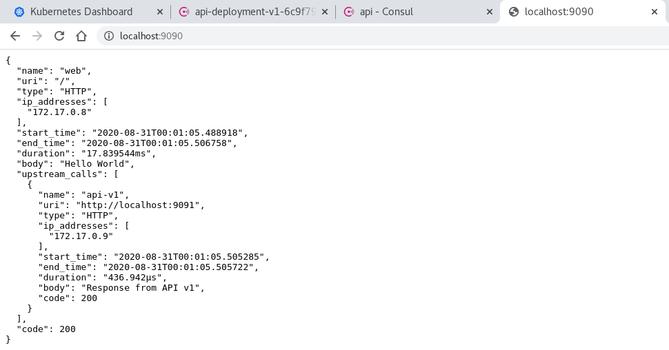


## Enforce a Zero-trust Network with Consul Service Mesh

* Create consul `deny all` intention
```
[fli@koala minikube-lab]$ kubectl exec -it hashicorp-consul-server-0 -- /bin/sh
/ # consul intention create -deny "*" "*"
Created: * => * (deny)
/ # consul intention check web api
Denied
/ # 
```

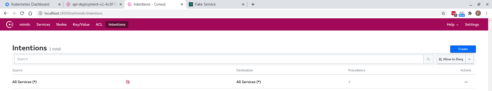

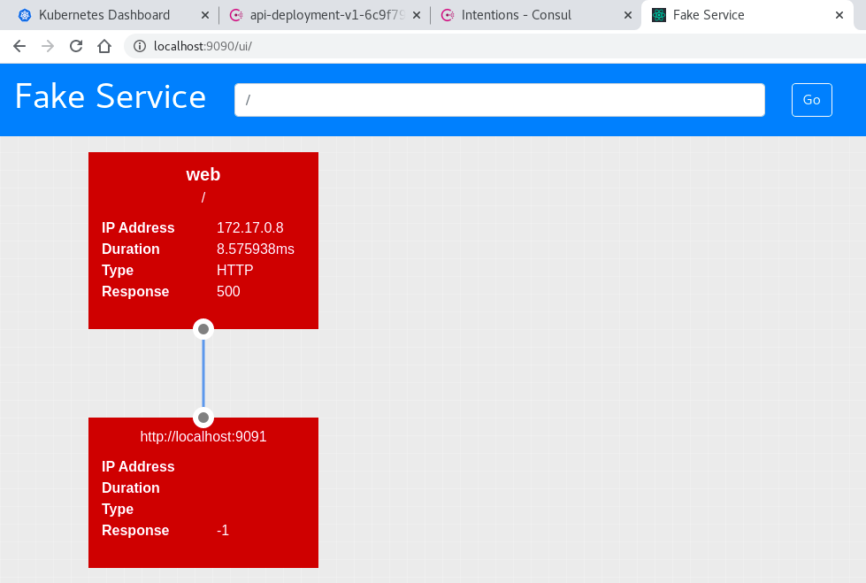

* Permit service communication with intentions
```
[fli@koala minikube-lab]$ kubectl exec -it hashicorp-consul-server-0 -- /bin/sh
/ # consul intention create -deny "*" "*"
Created: * => * (deny)
/ # consul intention check web api
Denied
/ # consul intention create -allow web api
Created: web => api (allow)
/ # consul intention check web api
Allowed
/ # 
```

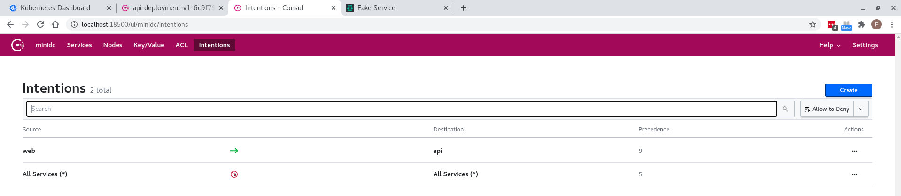

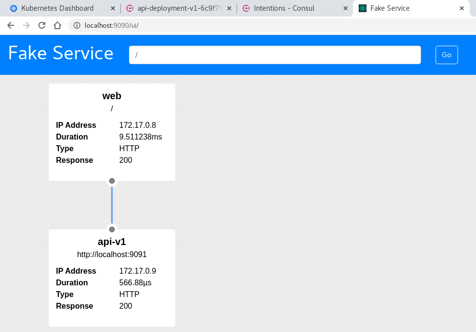


